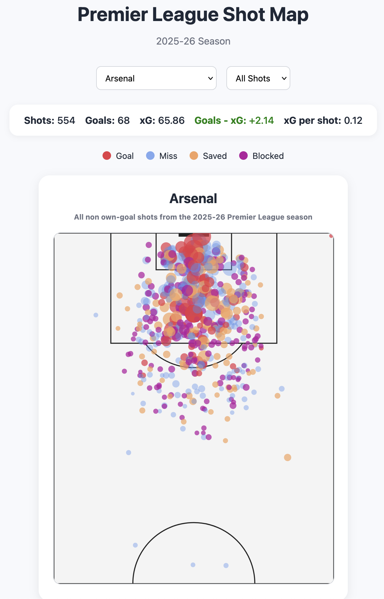
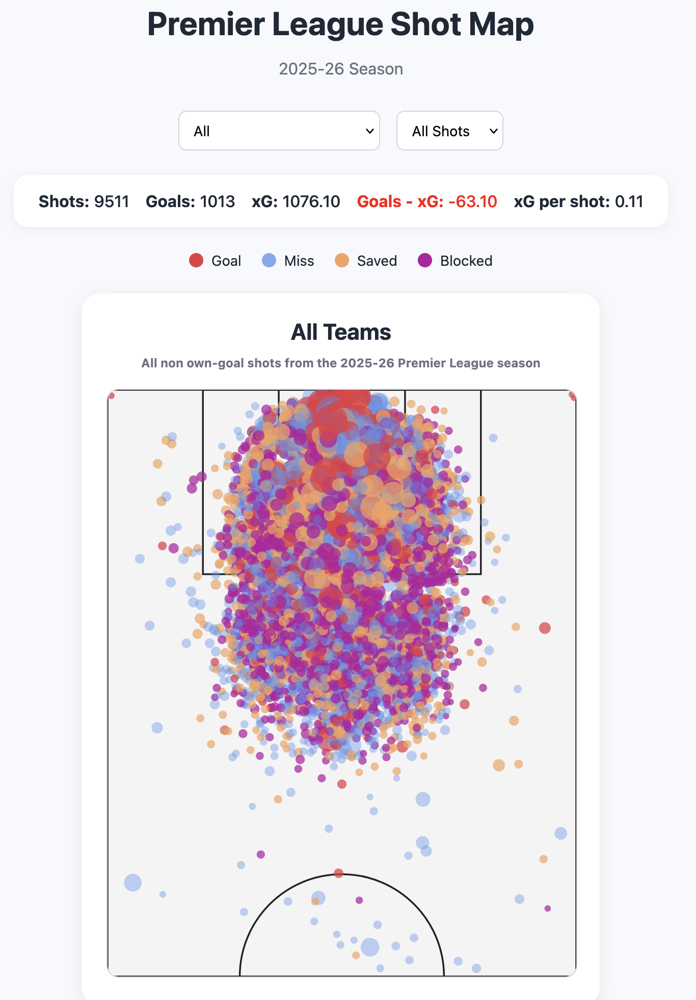
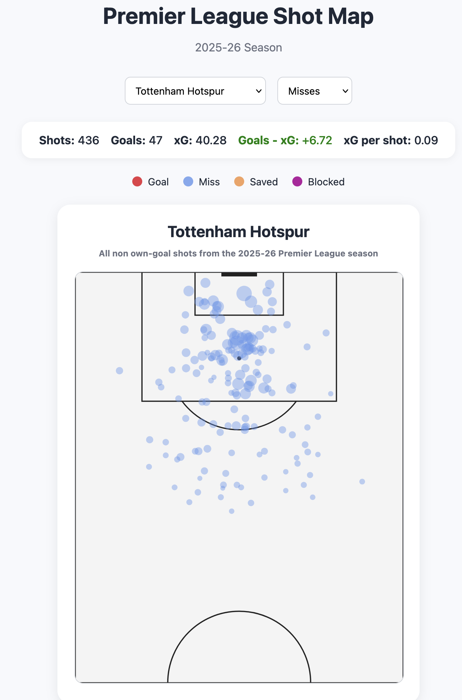

# Premier League Shotmap Dashboard

This interactive dashboard visualizes all non-own-goal shots taken in the Premier League during the 2025–26 season. Users can filter by team and shot outcome to explore shooting patterns, chance quality, and finishing performance across the league.

## Live Demo
https://jsonrbrt.github.io/premier-league-shot-map/

## Screenshots

### Arsenal Shot Map


### All teams Shot Map


### Filter to misses (shots off target)


## Features

- **Team selection filter**: select a team to see their shotmap for the current season.
- **Outcome selection filter**: select shots that correspond to certain outcomes (goals, saved, missed, blocked)
- **Stats summary panel**: Display a summary of stats such as shots, goals, expected goals/xG, xG overperformance/underperformance, and xg per shot.
- **Tooltips for more details**: Hover over any shot to see more details such as the shot taker, xG, minute, and outcome.

## Data Source

All shots data available on SofaScore. This project utilizes ScraperFC python package to access SofaScore's public API and process the data into a JSON format.

Sample of an entry in the JSON shot data:
```
{
    "match_id": 14023987,
    "team": "Arsenal",
    "opponent": "Everton",
    "player": "Max Dowman",
    "x": 0.42700000000000005,
    "y": 0.139,
    "shotType": "goal",
    "xg": 0.91279739141464,
    "xgot": 0.99494343996048,
    "result": "Goal",
    "minute": 90
  }
```

## Installation

Clone the repository:

```bash
git clone https://jsonrbrt.github.io/premier-league-shot-map/
```

Navigate into the project folder:

```bash
cd shotmap
```

Run the project locally using a development server such as the VS Code Live Server extension.

## Data Collection (Optional)

Shot data was collected using Python and the ScraperFC package.

Install dependencies:

```bash
pip install ScraperFC pandas
```

Run the scraping script:

```bash
python scripts/data.py
```

## Usage

* Select a team from the dropdown menu
* Filter shots by outcome (goals, saved, blocked, misses)
* Hover over shots to view player, xG, minute, and outcome details

## Tech Stack
- HTML
- CSS
- Vanilla JavaScript
- SVG for Shot Map rendering
- Python
- Pandas
- ScraperFC
- SofaScore API

## Challenges & Learnings

- Normalizing shot coordinates so both teams attack the same direction
- Cleaning NaN values from the dataset
- Managing frontend state for team and shot outcome filters
- Rendering scalable SVG shot maps using xG-based sizing
- Handling asynchronous data loading and error states

## Roadmap

- Add player selection filter
- Add link to video highlights for every goals in the tooltip

## License

[MIT](https://choosealicense.com/licenses/mit/)